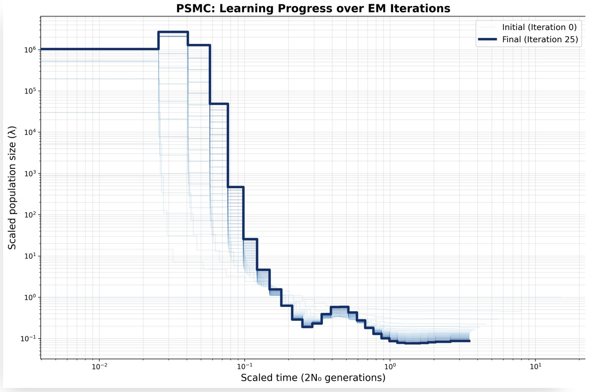
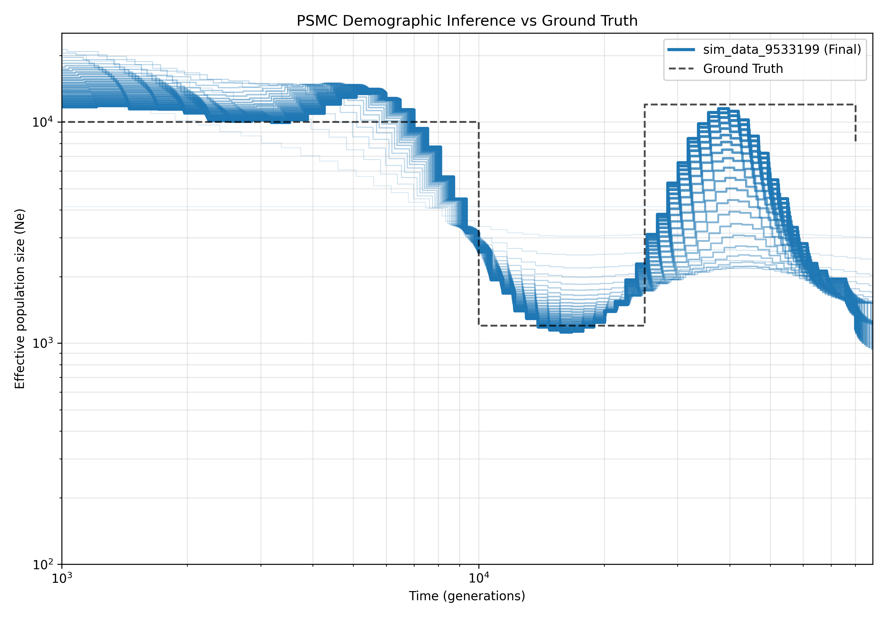
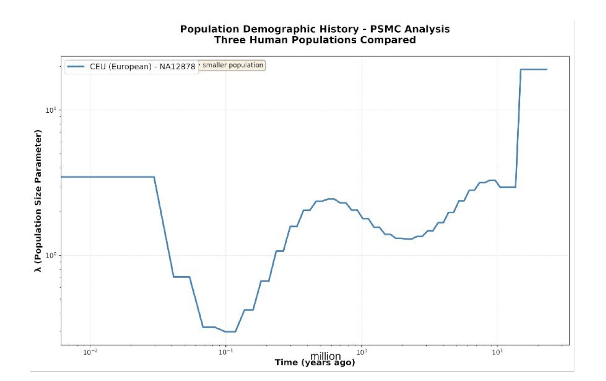
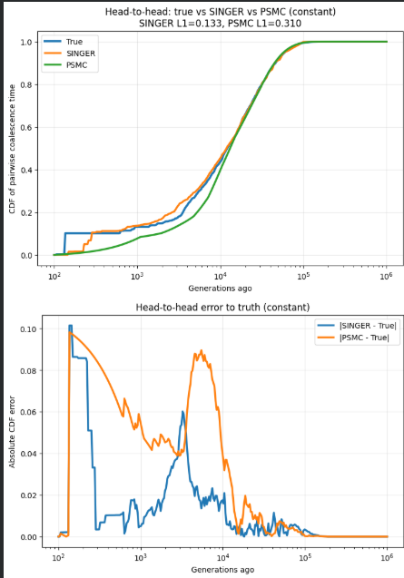
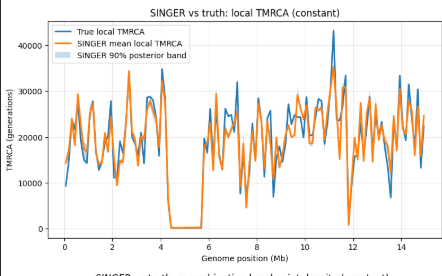
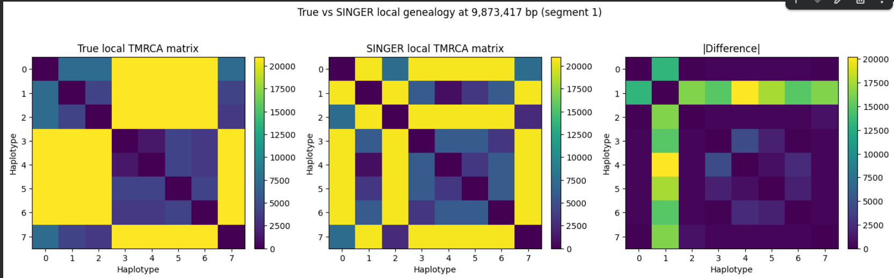
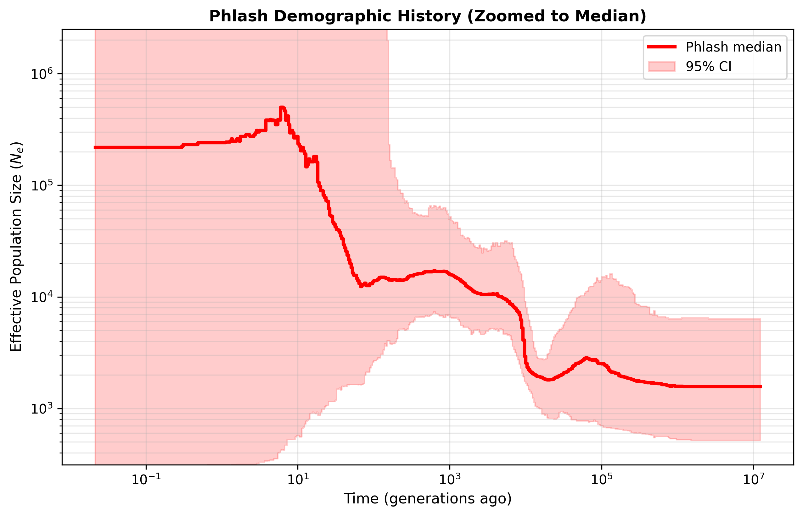
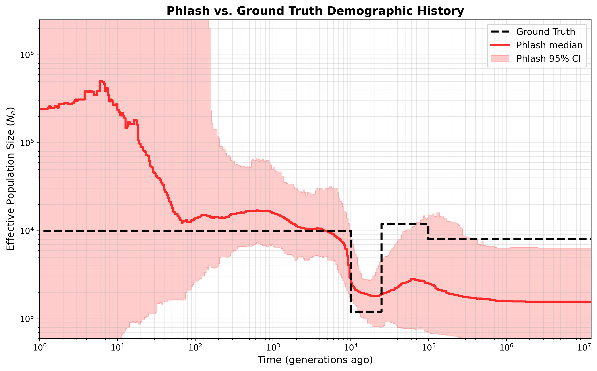

# PSMA for Inference of Human Population History from Single Diploid Sequence

PSMC (Pairwise Sequentially Markovian Coalescent) is a method for inferring the demographic history of a population from a single diploid genome sequence. It models the coalescent process along the genome, allowing for the estimation of effective population size changes over time.

This repository contains the experiments done to replicate the results of the [PSMC paper](https://www.nature.com/articles/nature10231) using human genome data. The code and data used for the analysis are provided here for reproducibility and further exploration.

*Course*: Big Data Biology, DS202
*Contributor*: Anirudh Gupta, Savyasachi Deval

## Datasets

There are two types of datasets used, one is simulated data, which is generated using the `ms` software(or `msprime` in python), and the other is real human genome data, which is obtained from the 1000 Genomes Project.

*Why use simulated data?* Simulated data allows us to validate the PSMC method under controlled conditions where the true demographic history is known. This helps in assessing the accuracy and robustness of the method.
*Why use real human genome data?* Real data provides insights into the actual demographic history of human populations based on models used like PSMC, PHLASH, SINGER, etc. It allows us to compare the inferred demographic history with known historical events and data obtained from experiments.

### Human Genome Data

To download the real human genome data(each BAM file is around 15-16GB's), you can use the following command:

```bash
mkdir -p datasets/

## Human Genome NA12878
curl -o datasets/NA12878.bam ftp://ftp.1000genomes.ebi.ac.uk/vol1/ftp/phase3/data/NA12878/alignment/NA12878.mapped.ILLUMINA.bwa.CEU.low_coverage.20121211.bam
curl -o datasets/NA12878.bam.bai ftp://ftp.1000genomes.ebi.ac.uk/vol1/ftp/phase3/data/NA12878/alignment/NA12878.mapped.ILLUMINA.bwa.CEU.low_coverage.20121211.bam.bai

## Human Genome NA18561
curl -o datasets/NA18561.bam https://ftp.1000genomes.ebi.ac.uk/vol1/ftp/phase1/data/NA18561/alignment/NA18561.mapped.ILLUMINA.bwa.CHB.low_coverage.20101123.bam
curl -o datasets/NA18561.bam.bai https://ftp.1000genomes.ebi.ac.uk/vol1/ftp/phase1/data/NA18561/alignment/NA18561.mapped.ILLUMINA.bwa.CHB.low_coverage.20101123.bam.bai
```

You also need to download a reference genome for the human genome data.

```bash
curl -o datasets/hs37d5.fa.gz ftp://ftp.1000genomes.ebi.ac.uk/vol1/ftp/technical/reference/phase2_reference_assembly_sequence/hs37d5.fa.gz
```

### Simulated Data

For simulated data, we use the `ms` software to generate sequences under a specified demographic model. We use python to run the simulations and generate the input files for PSMC.
For python, we use [msprime](https://pypi.org/project/msprime/) to generate the random simulated data for every run(using a random seed) but they have similar demographic features. We run [simulate_data.py](./scripts/simulate_data.py) to generate the simulated data to get `sim_data_<RANDOM_SEED>.psmc` and `sim_data_<RANDOM_SEED>.psmcfa` file.

```bash
python3 scripts/simulate_data.py
```

## Running PSMC

Before running PSMC, we need to install some necessary other tools as well, such as `samtools`, `bcftools`, and `vcfutils.pl`. You can install these tools using your package manager, for example:

```bash
sudo apt-get install samtools bcftools perl gnuplot
```

To run PSMC on any data, we use the [psmc](https://github.com/lh3/psmc) github repository and build it from source with:

```bash
git clone https://github.com/lh3/psmc.git
cd psmc
make all
# build fq2psmcfa separately
cp kseq.h utils/
gcc -o utils/fq2psmcfa utils/fq2psmcfa.c -O3
cd ..
```

### Pipeline for PSMC

Once we have the PSMC software built, we can run it on our data. Our main pipeline for running PSMC on the human genome data is [pipeline.py](scripts/pipeline_psmc.py). It processes the supported samples (`NA12878`) and does the following:

1. Checks whether a BAM index exists for each sample and creates it with `samtools index -@ 4` if needed.
2. Converts each BAM file into a gzipped FASTQ-like file using `bcftools mpileup`, `bcftools call`, and `vcfutils.pl vcf2fq`.
3. Converts the generated `.fq.gz` file into PSMC input format with `utils/fq2psmcfa -q20`.
4. Runs PSMC with the standard parameters `-N25 -t15 -r5 -p '4+25*2+4+6'` to produce a `.psmc` output file.
5. Creates a comparison plot for any available `.psmc` files and saves it as `datasets/psmc_plot.png`.

*Note:* For simulated datasets, we follow a similar pipeline, but we first generate the simulated data using `ms` or `msprime`.

You can run the pipeline for all supported samples or pass specific sample names, for example: (Note we use [uv](https://astral.sh/uv/) to run the python script, you can also use `python` or `python3` if you have the necessary dependencies installed)

```bash
uv sync # to install dependencies
uv run scripts/pipeline_psmc.py NA12878.bam
```

This will run the pipeline for`NA12878` samples, generating the necessary files and the comparison plot.

### Results

To validate the simulated data, we run PSMC on the simulated data.

1. *Learning of EM algorithm in PSMC*: We observe that as the number of iterations increases, the PSMC estimates converges. This shows that the EM algorithm is effectively learning the demographic history from the data and converging towards a stable solution.



2. *Comparison of PSMC with Ground Truth*: We compare the PSMC estimates with the true demographic history used in the simulation. The plot shows that PSMC gets closer and closer to ground truth as the number of iterations increases.



3. *Human Genome Results*: We also run PSMC on the real human genome data as mentioned above, an example plot among the obtained plots is shown below(for NA12878):



## SINGER

Check out the experiments we did at [experiments/PSMC_vs_singer_Simulated.ipynb](./experiments/PSMC_vs_singer_Simulated.ipynb) (Note this contains SINGER results as well). 





For the simulated experiments, **SINGER** is applied on the phased VCF generated from the same `msprime` simulation used for PSMC. This ensures that both methods are evaluated on identical underlying data.

In the notebook, SINGER is used for comparative analysis across the three demographic models:
- `constant`
- `bottleneck`
- `recent_expansion`

### Pipeline

To ensure scalability and stability, the simulated chromosome is divided into **5 Mb windows**.(similar to the experiments in the paper) For each window:
- `singer_master` is executed on the phased data
- Output **nodes** and **branches** files are generated
- These are converted into local tree sequences using a custom topology-only conversion into `tskit` format

### Analysis

From the reconstructed tree sequences, the following quantities are computed:
- Mean **local TMRCA** along the genome
- **Breakpoint density**
- **90% posterior bands** across SINGER samples

### Comparison

The notebook performs direct comparisons between:
- True ARG (from `msprime`)
- SINGER-inferred ARG

This includes:
- Local tree visualizations
- Small-region tree sequence panels
- ARG comparison plots

This setup enables a direct comparison of SINGER with both:
- Ground truth simulation
- PSMC results on the same dataset

## PHLASH

Phlash is a GPU accelerated implementation algorithm for inferring population history from genomic data. We use [jthlab/phlash](https://github.com/jthlab/phlash) for running the PHLASH algorithm for simulate data.

*NOTE*: We could not run PHLASH as it is on the GPU, so we changed the code to get it running on our GPU, we have provided the [phlash_gpu.patch](./phlash_gpu.patch) for the same.

We run our PHLASH script on the simulated data generated as mentioned above using [run_phlash.py](./scripts/run_phlash.py).

To run the PHLASH from scratch, you can follow the instructions below:

1. Setup Phlash:
```bash
git clone https://github.com/jthlab/phlash.git
cd phlash
uv sync # to install dependencies
```

2. Try to run the PHLASH on the simulated data:

```bash
source .venv/bin/activate # source the virtual environment
python3 run_phlash.py simulated_validation.psmc simulated_validation.psmcfa
```

If this works, great! Else try our patch for GPU support:

```bash
# Apply the GPU patch
git am phlash_gpu.patch

# Generate both full and zoomed plots
python3 scripts/plot_phlash.py --pkl phlash_output.pkl

# Compare with ground truth
python3 scripts/plot_phlash.py --pkl phlash_output.pkl --truth datasets/sim_data_<SEED>_truth.json
```

## Results

We used NVIDIA GeForce RTX 3050 GPU and ran PHLASH on the simulated data to obtain several files including:

1. `phlash_output.pkl`: This file contains the raw posterior samples from the PHLASH algorithm. Since Phlash is a Bayesian method using Stein Variational Gradient Descent (SVGD), the output is a set of "particles" that represent the approximated posterior distribution of the demographic history.

2. We generate separate visualizations to better understand the model's output:
   - **Full Range Plot**: Shows the complete vertical range of inferred population sizes, including the 95% Credible Interval (CI).
   - **Zoomed Plot**: Focused on the median population size to highlight the specific bottleneck and expansion events.

**What does the 95% CI mean in Phlash?**
The 95% Credible Interval (CI) represents the range in which 95% of the posterior samples (particles) fall at each time point. In our results, you may notice the CI expanding significantly (up to $10^{32}$) in the very recent or very ancient time periods. This indicates that the genomic data provides very little information about those specific time windows, causing the model to revert to its prior distribution with high uncertainty.

| PHLASH Full Range | PHLASH Zoomed |
|:---:|:---:|
|  |  |

### Comparison of PHLASH and Ground Truth
We also validated the Phlash results against the known ground truth from our simulation. After correcting for scaling (ensuring the window size of 100bp was properly accounted for during rescaling), we see that Phlash successfully captures the bottleneck and recovery events.



### Comparison of PHLASH and PSMC
We compare the PHLASH results with the PSMC results on the simulated data. 

1. *Time Taken / iteration*: Time taken by PSMC per iteration is around 4 seconds, while for PHLASH it is around 1.1 seconds, which shows that PHLASH is significantly faster than PSMC, as expected.

2. *Model Smoothness*: Unlike PSMC's discrete "staircase" output, Phlash produces much smoother demographic curves. This is because Phlash utilizes a Bayesian framework with a prior that penalizes sudden, sharp fluctuations in $N_e$. This regularization makes Phlash more robust to stochastic noise in the data but also results in "softer" transitions during sudden demographic events like bottlenecks, as it prioritizes a continuous and parsimonious history over localized jumps. 

This behavior makes Phlash particularly suitable for real human genome data, where true demographic changes are often gradual and the signal is mixed with significant sequencing noise.

# Acknowledgements

We have used AI(like Gemini, ChatGPT) for assistance in writing code and debugging PHLASH issues. However all the code and analysis have been done by us, and we have not used AI for writing any part of the report or analysis.
